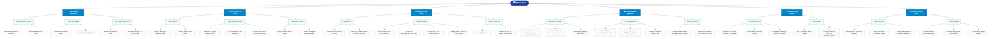

# Project Mind Map: "Daneben!" Smart Waste Bin System

```mermaid
flowchart TD
    %% Styling
    classDef core fill:#1e3a8a,stroke:#3b82f6,stroke-width:3px,color:#ffffff,font-weight:bold;
    classDef branch fill:#0284c7,stroke:#0369a1,stroke-width:2px,color:#ffffff,font-weight:bold;
    classDef sub fill:#f0fdf4,stroke:#16a34a,stroke-width:1px,color:#14532d;
    classDef detail fill:#f8fafc,stroke:#94a3b8,stroke-width:1px,color:#1e293b;

    ROOT(["🗑️ Daneben! Project<br/>Smart Waste Bin Detector"]):::core

    %% Main Branches
    ROOT --> B1["📡 Dual-Sensing Architecture"]:::branch
    ROOT --> B2["🧠 On-Device Edge AI Vision"]:::branch
    ROOT --> B3["⚡ Hardware & Power System"]:::branch
    ROOT --> B4["🛡️ IP67 Enclosure & Mechanics"]:::branch
    ROOT --> B5["📢 Deterrent & Cloud Telemetry"]:::branch
    ROOT --> B6["💼 Business & Municipal Impact"]:::branch

    %% Branch 1: Sensing
    B1 --> S1["External Ground Presence"]:::sub
    S1 --> S1a["JSN-SR04T Waterproof Ultrasonic"]:::detail
    S1 --> S1b["Monitors ground zone < 1.5m"]:::detail
    B1 --> S2["Internal Bin Capacity"]:::sub
    S2 --> S2a["Lid-mounted JSN-SR04T Sensor"]:::detail
    S2 --> S2b["Depth < 20cm flags Bin Full"]:::detail
    B1 --> S3["Two-Stage Debounce Filter"]:::sub
    S3 --> S3a["8-Second Persistence Timer"]:::detail
    S3 --> S3b["Discards passersby < 3s (GDPR Safe)"]:::detail

    %% Branch 2: Edge AI
    B2 --> A1["Camera Pipeline"]:::sub
    A1 --> A1a["OV2640 Camera (45° downward angle)"]:::detail
    A1 --> A1b["96x96 or 160x160 RGB Frame"]:::detail
    B2 --> A2["TinyML Model Architecture"]:::sub
    A2 --> A2a["MobileNetV2 / Edge Impulse FOMO"]:::detail
    A2 --> A2b["INT8 Quantization (~350 KB footprint)"]:::detail
    A2 --> A2c["ESP-NN SIMD Vector Acceleration (220ms)"]:::detail
    B2 --> A3["Classification Classes"]:::sub
    A3 --> A3a["Empty Pavement / Street Ground"]:::detail
    A3 --> A3b["Plastic Trash Bags & Cardboard Boxes"]:::detail

    %% Branch 3: Hardware & Power
    B3 --> H1["Compute Core"]:::sub
    H1 --> H1a["Seeed Studio XIAO ESP32-S3 Sense"]:::detail
    H1 --> H1b["Dual-Core 240 MHz + 8MB PSRAM + Wi-Fi/BLE"]:::detail
    B3 --> H2["Power Subsystem"]:::sub
    H2 --> H2a["18650 Protected Li-Ion (3.7V, 3400mAh)"]:::detail
    H2 --> H2b["5V-6V 1.5W Monocrystalline Solar Panel"]:::detail
    H2 --> H2c["CN3791 MPPT Solar Charge Controller"]:::detail
    H2 --> H2d["Average drain ~3.4mA (~35 Days runtime)"]:::detail
    B3 --> H3["Custom PCB (KiCad)"]:::sub
    H3 --> H3a["Inverted T shape layout"]:::detail
    H3 --> H3b["Status LEDs (D1, D2), Button, Power Header"]:::detail

    %% Branch 4: Enclosure & IP67
    B4 --> E1["Weatherproof Enclosure"]:::sub
    E1 --> E1a["UV-Resistant Polycarbonate Body (120x80x150mm)"]:::detail
    E1 --> E1b["20° Sloped Roof (snow/water shedding + solar angle)"]:::detail
    E1 --> E1c["Overhanging Drip Edge over Seams"]:::detail
    B4 --> E2["Port Sealing Methods"]:::sub
    E2 --> E2a["Camera: Ø20mm Borosilicate Glass + UV Glue"]:::detail
    E2 --> E2b["Speaker: Hydrophobic ePTFE Acoustic Vent (Gore-Tex)"]:::detail
    E2 --> E2c["Perimeter: Continuous Silicone O-Ring"]:::detail
    B4 --> E3["Service & Mounting"]:::sub
    E3 --> E3a["Bottom Threaded Battery Cartridge (No box opening)"]:::detail
    E3 --> E3b["Rear slots for Stainless Hose Clamps / UV Ties"]:::detail

    %% Branch 5: Deterrent & Cloud
    B5 --> D1["Local Audio Deterrent"]:::sub
    D1 --> D1a["MAX98357A I2S Mono Amplifier + 2W Speaker"]:::detail
    D1 --> D1b["Prompts user if bin still has capacity"]:::detail
    D1 --> D1c["Logs Ignored Warnings after 5-min cooldown"]:::detail
    B5 --> D2["Cloud Telemetry"]:::sub
    D2 --> D2a["MQTT / LoRaWAN Status Payload"]:::detail
    D2 --> D2b["Flags: ILLEGAL_DUMPING, BIN_FULL, BATTERY_VOLTS"]:::detail

    %% Branch 6: Business & Market
    B6 --> M1["Target Customers"]:::sub
    M1 --> M1a["Municipalities & Smart City Programs"]:::detail
    M1 --> M1b["Waste Contractors (Remondis, Veolia)"]:::detail
    M1 --> M1c["Property Management & Housing Associations"]:::detail
    B6 --> M2["Value Proposition"]:::sub
    M2 --> M2a["SaaS Dashboard ($3-$5/bin/month)"]:::detail
    M2 --> M2b["Dynamic cleaning crew route dispatch"]:::detail
    M2 --> M2c["5-Year outdoor design lifespan"]:::detail
```
